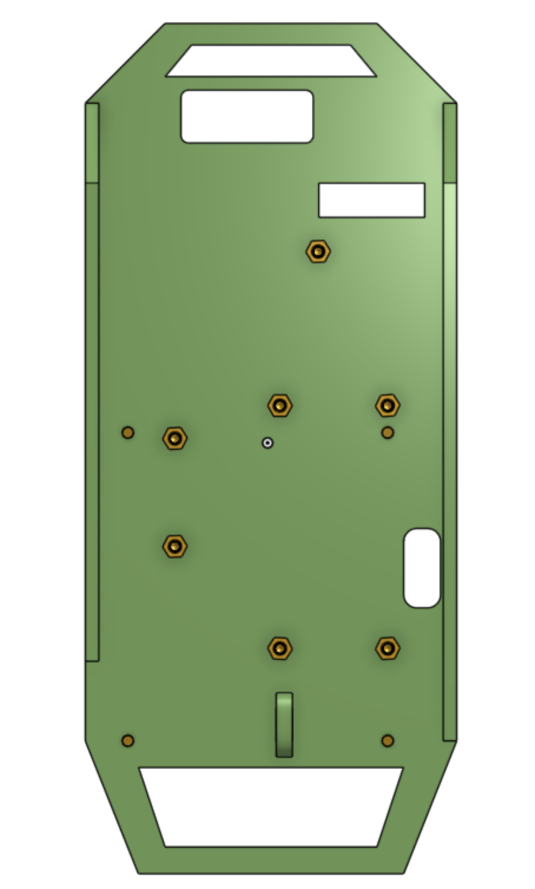
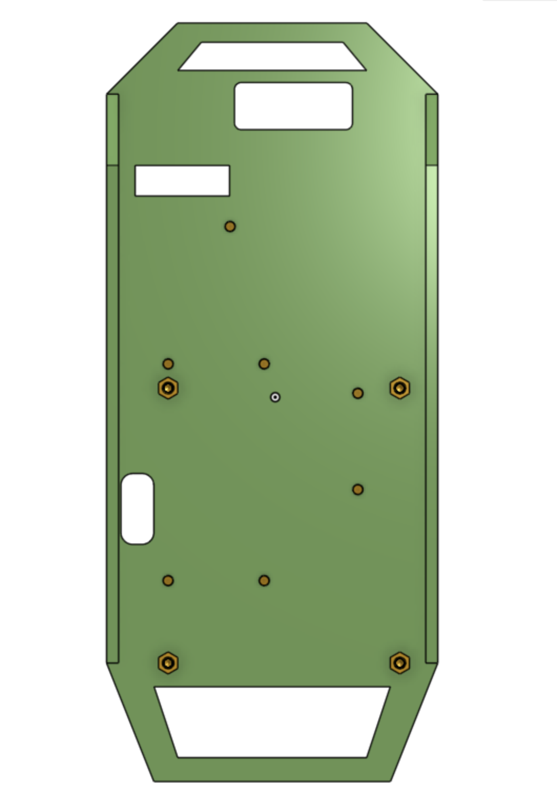
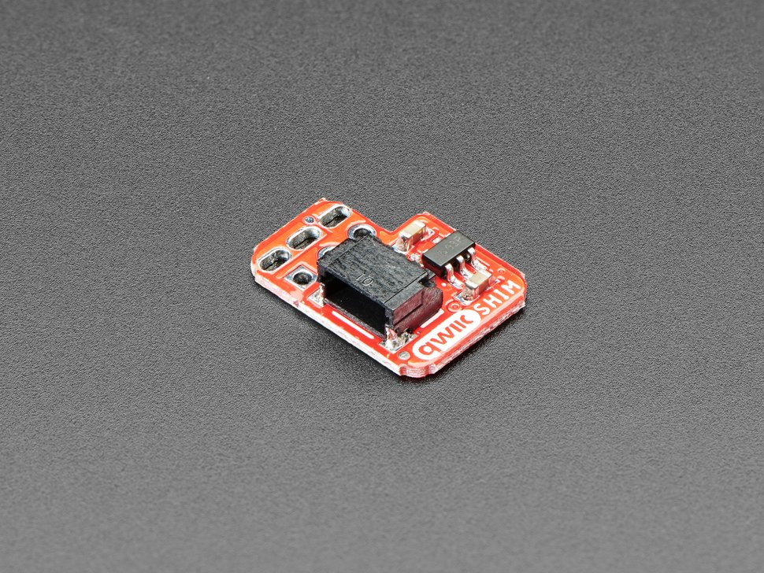
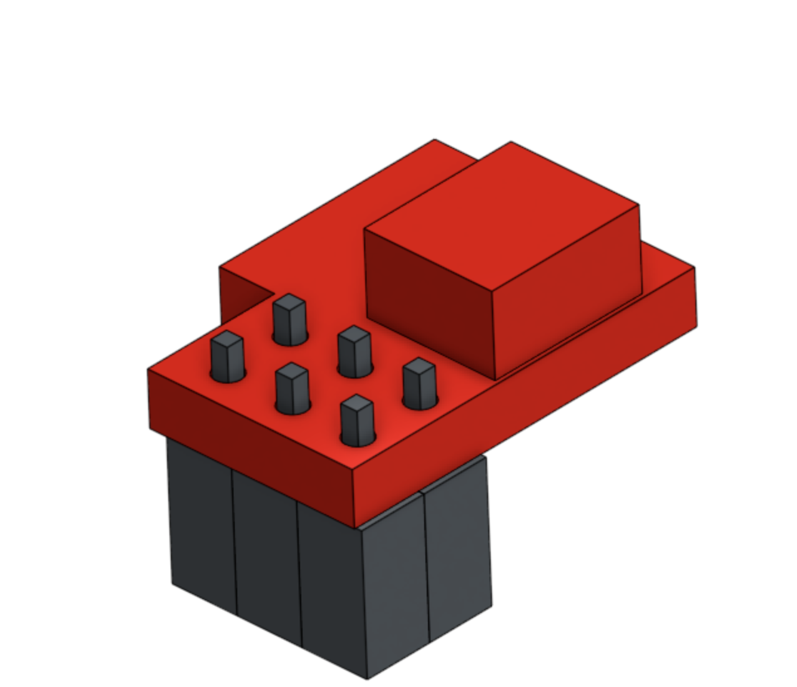
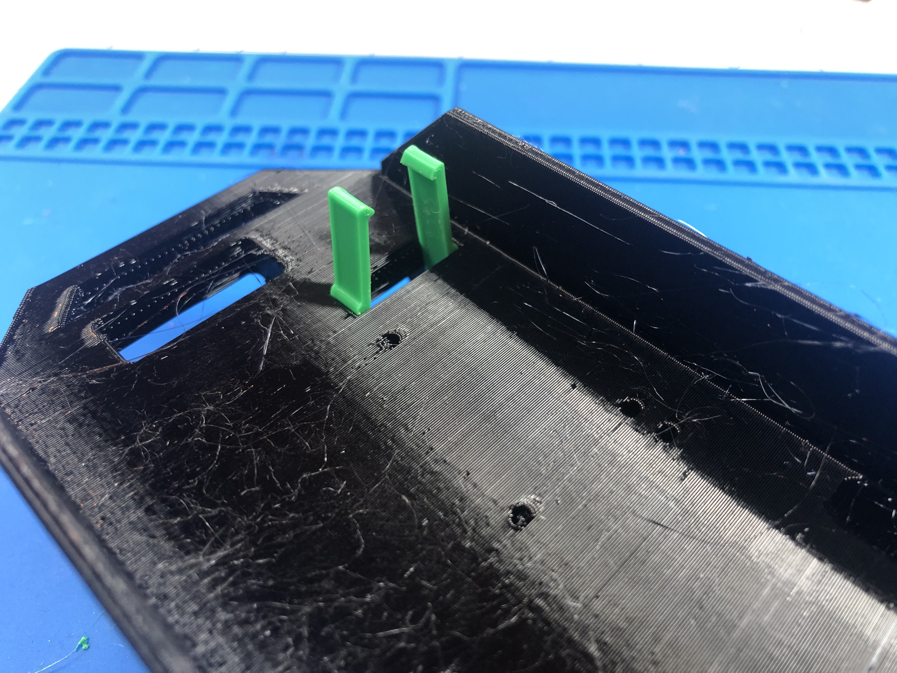
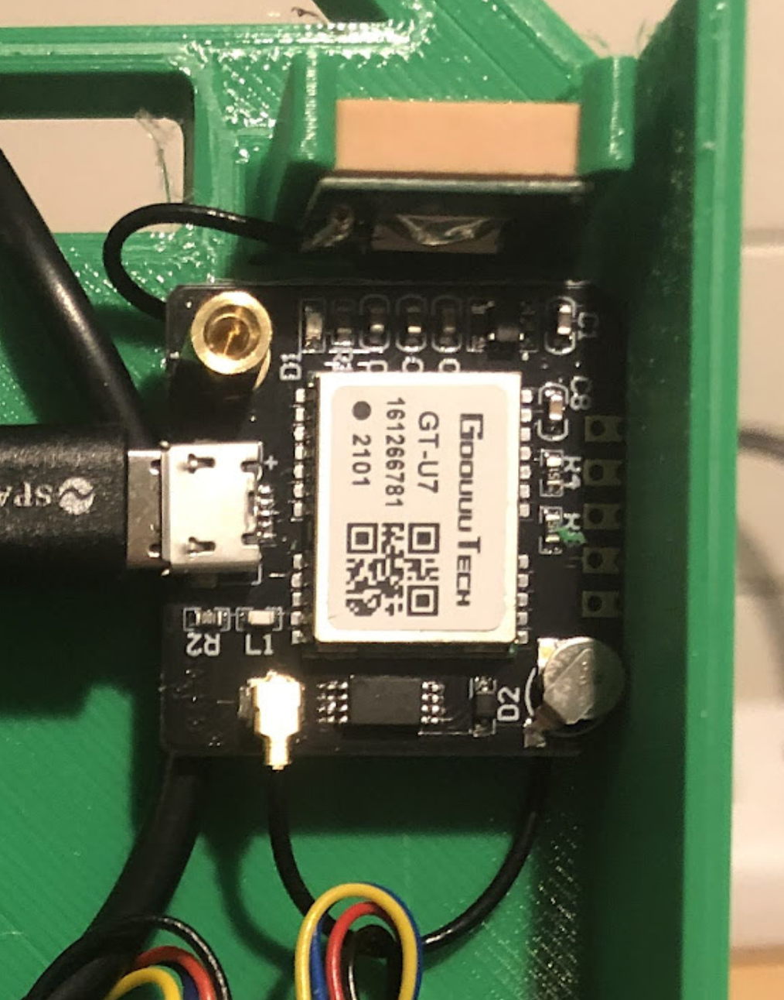
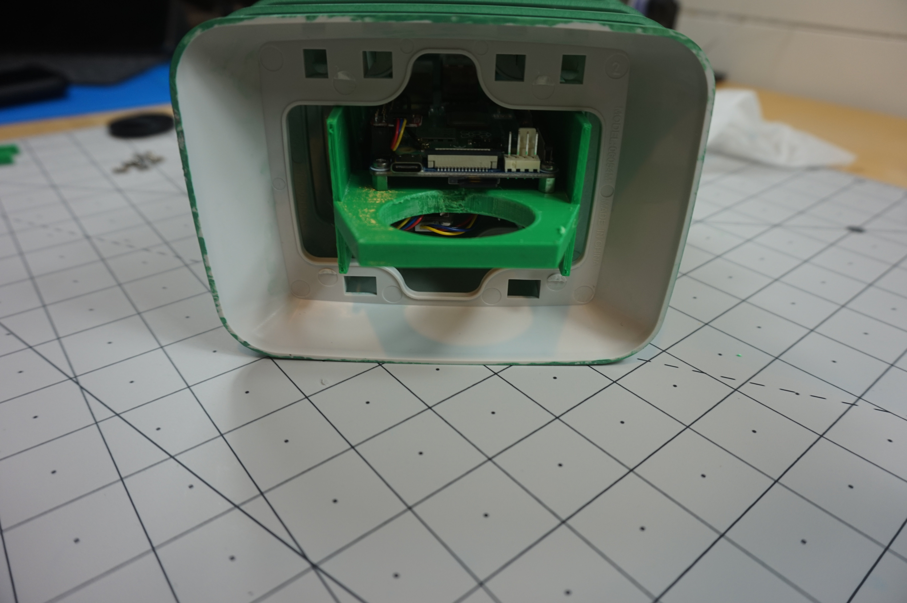

# Electronics Assembly

Now to assemble the electronics. The first step is to attach all of the electronics to the 3D printed bracket.

## Electronics Standoffs

To do this, attach the brass standoffs to the bracket which we will attach the electronics to. This is easiest to do with a 4.5 hex socket. Be careful not to over tighten the standoff in the bracket!

https://user-images.githubusercontent.com/2559382/131203360-0a97f4ac-2007-4650-8da2-7b24859d4129.MOV

There are 11 standoffs to install. See the images below for the locations.

There are 7 standoffs on the side of the bracket with the antennae loop:

There are 4 standoffs on the opposite side where the Raspberry Pi will attach:

## Attach Electronics
Now it's time to attach the electronics to the standoffs. Attach the Raspberry Pi Carrier Board on one side, the SCD30, Barometer, and GPS on the other side as shown in the photos below:

## Install Rasperry Pi Compute Module

The Raspberry Pi Compute Module 4 should just click into the connectors on the carrier board you installed in the previous step.

## Soldering Raspberry Pi QWIIC Adapter
The qwiic adapter to connect the CO2 sensor to the Raspberry Pi comes without headers soldered on.

You'll need to solder on headers to the bottom, like so:

## GPS Antennae Clip
Now it's time to install the GPS Antennae clip into the main bracket: 

 Once the clip is installed, you insert the antennae into the clip and then connect the connector to the connector on the GPS board. See the image below for the orientation. Remember to orient the antennae so the cable comes out on the side to prevent it from catching on the enclosure later.

## Cables
There are three cables that need to be installed as shown in the pictures above:
* The USB cable - This goes from the Raspberry Pi to the GPS module as shown in the pictures above. Notice the loop which keeps the cable managed nicely.
* STEMMA QT / Qwiic JST SH 4-pin Cable - 50mm Long - The Cable from the SCD30 CO2 sensor to the barometer
* STEMMA QT / Qwiic JST SH 4-pin Cable - 100mm Long - The Cable from the SCD30 CO2 sensor to the Raspberry Pi
* Wifi antennae - This gets screwed into the loop on the sensor side of the bracket and goes to the Raspberry Pi on the other side

Everything should look like this when you are done:

## Install Electronics Into Enclosure

The final step is to slide the completed electronics bracket into the enclosure. The GPS Antennae side of the bracket should go into the enclosure first, so that the USB C power connector on the bottom of the Rapsberry Pi Carrier board is accessible at the bottom. See this image with the body of the enclosure cut away:

## Assembly complete!

The electronics assembly is now complete! The only pieces you should have left are the SD card and power cord which we will install in the next steps.

## Next Step
[Software Installation](6-software.md)

## Previous Step
[Go Back](4-electronics-weatherproofing.md)

## Table of Contents
[Return to the Beginning](0-start-here.md)

## Need Help?
No problem! The Ribbit Network team is here for you! We have lots of ways to connect. Jump in and ask your question or provide a suggestion!
* [Start a discussion here](https://github.com/Ribbit-Network/ribbit-network-frog-sensor/discussions/new)
* [Join the Developer Discord](https://discord.gg/vq8PkDb2TC)
