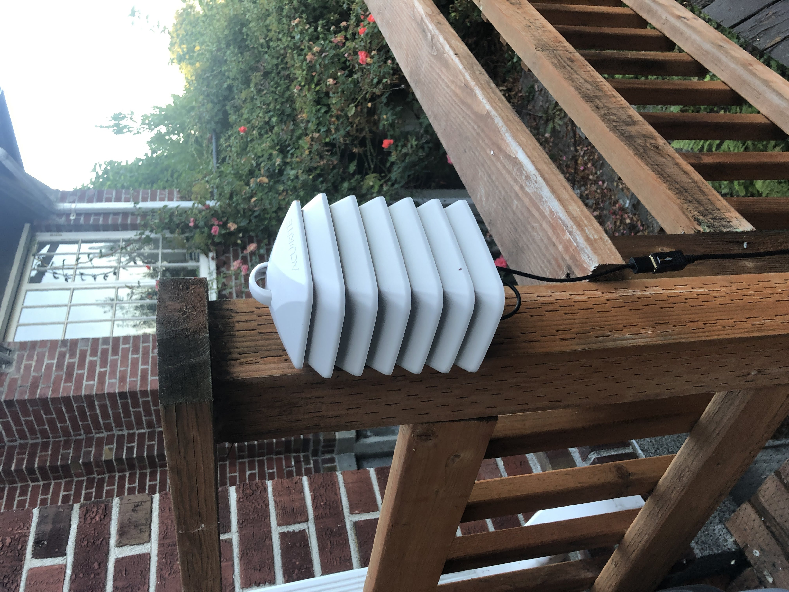

# Sensor Placement

Now it's time to place our sensor in it's home outside.

You can use the loop on the top of the sensor to hang the sensor somewhere or use the slot on the backside to hang the sensor on a nail.

The location will need to be near a power outlet to ensure there is power for the sensor. Ideally it should be as high as possible and as far away from structure like walls or corners to ensure maximum airflow.

Try to ensure the space above the sensor is largely unobstructured so that the GPS unit can obtain an accurate position (don't place the sensor in a shed for instance).

## Power Cable
Connect the USB C power supply to the USB C connector on the bottom of the raspberry pi carrier board and plug the sensor into a normal wall outlet.

## Next Step
[View the data!](7-done.md)

## Previous Step
[Go Back](5-software.md)

## Table of Contents
[Return to the Beginning](0-start-here.md)

## Need Help?
No problem! The Ribbit Netowrk team is here for you! We have lots of ways to connect. Jump in and ask your question or provide a suggestion!
* [Start a dicussion here](https://github.com/Ribbit-Network/ribbit-network-frog-sensor/discussions/new)
* [Join the Developer Discord](https://discord.gg/vq8PkDb2TC)